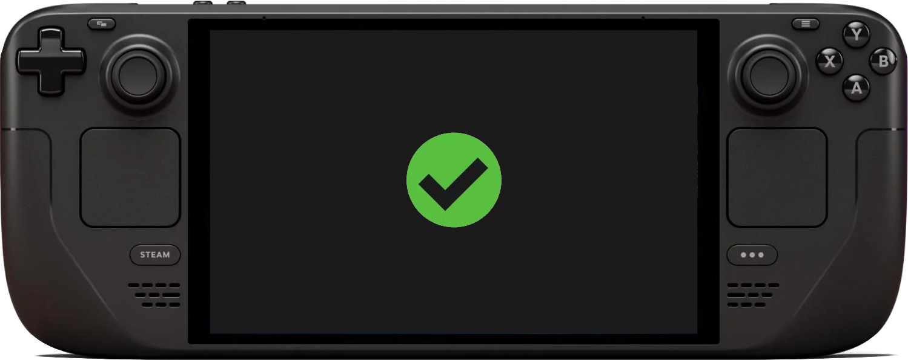

# 🎮 Deck Settings - Game Compatibility and Configuration Reports

Welcome to Deck Settings – a community-driven repository focused on collecting and organizing game settings, performance tweaks, and compatibility reports specifically for handheld gaming devices like the Steam Deck, ROG Ally, and other portable gaming PCs.

By contributing game reports, you help the community optimize performance, troubleshoot issues, and create a central knowledge base for the best possible gaming experience on the Steam Deck.

## 🚀 Why Deck Settings?

While platforms like [ProtonDB](https://www.protondb.com/) and [ShareDeck](https://sharedeck.games/) exist to track game compatibility, Deck Settings was created to address key limitations found in those platforms:

#### 1. 🔄 Editable and User-Controlled Reports

- ProtonDB allows you to submit multiple reports on the same game but does not let you edit or update a report directly.
- If you want a report removed on ProtonDB, you need to submit a ticket and wait for admin approval.
- ShareDeck lacks consistency in report formatting and often presents issues when trying to edit reports after submission. This makes viewing reports difficult and many reports end up looking like long paragraphs of unformatted text.

👉 Deck Settings allows users to fully control their game reports. You can update or close your own reports without waiting for admin intervention.

#### 2. 📱 Mobile-Friendly Reporting and Viewing

- Viewing or submitting reports on ProtonDB and ShareDeck can be frustrating on mobile devices.
- Deck Settings is designed to provide a clean, mobile-friendly experience for both submitting and browsing reports.

👉 For the best experience, we recommend downloading the official [GitHub mobile app](https://github.com/mobile) to easily create, edit, and view game reports on the go.

#### 3. 🎯 Focus on Handheld Gaming Devices

- ProtonDB primarily focuses on Proton compatibility and generic Linux gaming, with a dedicated section for Steam Deck. However, it lacks dedicated support for other handheld devices.
- Deck Settings expands compatibility reporting to handhelds like the ROG Ally, Lenovo Legion Go, and other emerging portable gaming PCs.
- Reports are tagged by device type, allowing users to filter and find configurations tailored to their hardware.

#### 4. 🛠️ Support for Games Without Steam IDs

- ProtonDB and ShareDeck focus on Steam games, making it difficult to submit reports for titles that don’t have a Steam App ID.
- This is frustrating for users who want to track configurations for:
  - Games from Itch.io, GOG, Epic Games, and other platforms.
  - Delisted Steam games that still have App IDs but cannot be reported on.

👉 Deck Settings makes Steam App IDs optional. Whether the game is from Steam or elsewhere, you can still submit a full configuration report.

#### 5. 💬 Community Discussion and Voting

- Deck Settings leverages GitHub's issue system to enable community interaction on game reports.
- Users can react with a 👍 (thumbs up) to indicate that a report was helpful, allowing others to easily find reliable configurations by sorting reports based on reactions.
- If you have alternative settings or suggestions for an existing report, you can **add comments directly** to the report for further discussion.

👉 Deck Settings creates a dynamic platform where reports can evolve over time, reflecting the latest tips, tweaks, and troubleshooting steps from the community.

## 📝 How to Submit a Game Report

Submitting a game report is quick and easy.

### 📄 New Report Submission:

👉 [Create a New Game Report](https://github.com/DeckSettings/game-reports-steamos/issues/new?assignees=&labels=&projects=&template=GAME-REPORT.yml&title=%28Placeholder+-+Issue+title+will+be+automatically+populated+with+the+information+provided+below%29)

Click the link above to generate a new report using our pre-filled template.

### 🔧 Filling Out the Report:

- **Game Name** – Full name of the game.
- **Launcher** – Specify whether the game is run via Steam, Lutris, Heroic, etc.
- **Deck Compatibility** – Indicate overall compatibility (Perfect, Playable, or Unplayable).
- **Target Framerate** – Expected framerate (30, 40, 60, etc.).
- **Device** – Specify which handheld device was used (e.g., Steam Deck, ROG Ally, etc).
- **SteamOS Version** – OS version during testing.
- **Frame Limits** – Frame limiter, TDP limit, GPU undervolt, or custom scaling applied.
- **Launch Options** – Any custom Steam launch options or environment tweaks.
- **Graphics Settings** – Share your in-game graphics settings (low, medium, high, custom).
- **Additional Notes** – Share any relevant findings, bugs, or workarounds.

### 🛠️ Automated Report Validation

Game reports are automatically validated on submission and during a weekly scheduled check to ensure they meet the required format and include all necessary details.

- If a report is missing information or if new requirements are introduced after submission, the automated validation system will flag the report.
- A bot will apply a label and post a comment identifying the sections that need updates. Simply edit the report, add the missing details, and resubmit.
- Reports that remain flagged for too long may be closed automatically. Closed reports can be reopened and updated at any time.

This process ensures the database stays organized and that all reports provide the most accurate and useful information for the community.

## 📊 Why Contribute to Deck Settings?

- **Full Control** – Submit, update, or delete your own reports freely.
- **Help Others** – Your experience benefits others who may be playing the same game.
- **Troubleshooting** – Create a database of fixes and workarounds for common issues on specific hardware.
- **Support All Games** – Build a library of reliable configurations for easy reference across all games, including non-Steam titles.

## 🔍 How to View Existing Reports

Browse and search submitted game reports by visiting the [Issues Section](https://github.com/DeckSettings/game-reports-steamos/issues).

- Use the **Labels** and **Projects** filters to narrow down reports by:
  - **Device Type** – Steam Deck, ROG Ally, Lenovo Legion Go, etc.
  - **Launcher** – Steam, Heroic, Lutris, etc.
  - **Compatibility** – Verified, Playable, or Unsupported.
  - Etc.
- Then use the **Sort** feature to sort by:
  - Newest reports
  - Recently updated reports
  - Most reactions
  - Most commented
  - etc.

## ❤️ Join the Community

Deck Settings is built by the community, for the community. If you’re passionate about the Steam Deck and handheld gaming, we’d love your input.

👉 Submit a Game Report or start contributing today!

## 📬 Questions or Feedback?

Feel free to join us on [Discord](https://streamingtech.co.nz/discord) if you have any suggestions for this project or want to contribute ideas.

Contributions aren't limited to game reports! You can also help by:

- **Improving Templates** – Suggest better fields for game reports.
- **Automating Validation** – Help automate report validation using GitHub Actions. Scripts for these actions are found in the `scripts` directory.
- **Enhancing Documentation** – Providing PRs for this README or other Markdown files for guides or tips for configuring games.

If you have suggestions or want to contribute code, feel free to submit a pull request or open a discussion.
